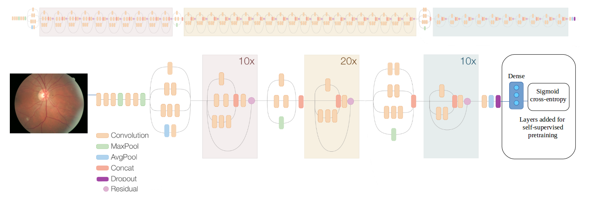
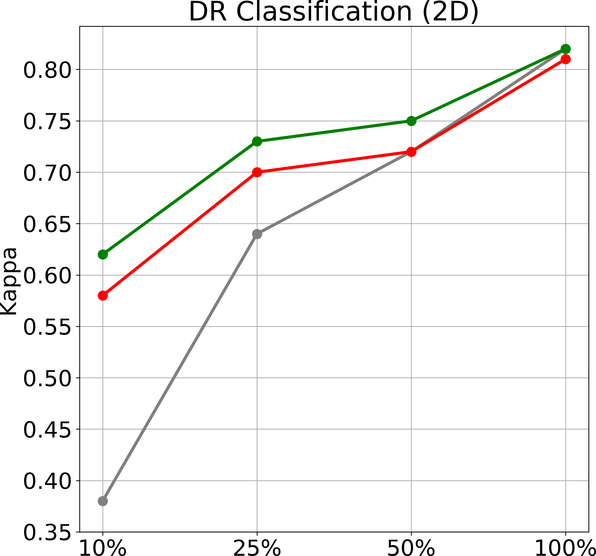

# Applying Surrogate-supervision on Diabetic Retinopathy Classification

 ## Data and Background
Diabetic Retinopathy (DR) is an eye disease associated with long-standing diabetes. The different stages of DR can be determined by the severity and position of its associated lesions that arise from vascular abnormalities. The data obtained from the Kaggle Dibetic Retinopathy Detection [1] challenge consists of a total of nearly 88,000 color fundus images that each have one of 5 labels based on the level of DR associated with that image- 0: No Diabetic Retinopathy, 1: Mild  Diabetic Retinopathy(microaneurysms),  2: Moderate  Diabetic Retinopathy(mild hemorrhage/exudates),  3: Severe  Diabetic Retinopathy(severe hemorrhage, exudates and/or venous beading),  4: Proliferative  Diabetic Retinopathy(neovascularization and/or pre-retinal hemorrhage). We have split the data into train (Trl=70,000 images), validation (Vl=3,000) and test (Tel=15,000) sets for our supervised experiments. Furthermore, since the provided data is fully labeled, we created an unlabeled dataset Du for the self-supervised task by merging Trl and Vl followed by removing the DR labels. 

 ## Self supervised pre-training 
We used rotation as surrogate supervision to pre-train an Inception-resnet-v2[2]. For this purpose, we appended this architecture with a fully connected layer with 3 neurons followed by a sigmoid cross entropy loss layer. Each of the 3 neurons is responsible for detecting a certain degree of rotation. In our experiments, we chose to use 0°, 90°, and 270° rotation. In other words, each unlabeled image from Du was assigned 1 of the 3 surrogate labels depending on the degree of apllied rotation. Note that applying a 180° rotation on the retina image from the left eye results in an image with appearance to the unrotated retina image from the right eye. In view of this ambiguity, we did not use a 180° rotation during training with surrogate supervision. Nevertheless, rotation is a reasonable surrogate for DR because fundus images have a consistent geometry; thus, our model can learn the relative locations of structures such as the macula, optic disc, and retinal network by learning to predict the rotation. We trained the network for 200 epochs using an adam optimizer with an initial learning rate of 10-4  and learning rate decay factor of 0.8 after the first 40 epochs. 

 ## Supervised training 
To train the multi-class DR classification model, we used the Inception-resnet-v2[2] architecture pre-trained above. Specifically, we removed the layers related to self-supervised pre-training and appended the architecture with a fully connected layer with 5 neurons (we have 5 DR labels) followed by a sigmoid cross entropy loss function. We used a momentum optimizer with a momentum of 0.9. The model was trained to distinguish the 5 DR classes for 250 epochs (500,000 steps) using a batch size of 12 with an initial learning rate of 10-3 followed by a manual learning rate decrease every 100 epochs. 

 ## Results
The following figure compares the DR models trained from scratch, trained from ImageNet, and trained from weights pretrained with surrogate supervision. To study the impact of surrogate supervision under various sizes of the traing set, we trained the above 3 models using 10%, 15%, 50%, 100% of the labeled training data, Trl. Larger training sets were a super set of the smaller training sets. We used the Kappa statistic to measure the agreement between model predictions and ground truth, as is done in the Kaggle competition.
  
 <!-- .element height="10%" width="10%" -->

 We see that pre-training with surrogate supervision enables the training of better-performing models than not only the models trained from scratch but also the models trained from ImageNet. These results suggest that pre-training with surrogate supervision in the target domain can be more effective than transferring weights from an unrelated domain even though the transferred weights are trained using much stronger supervision. From the figure above, we can also se that performance gain is more substantial for smaller training sets, suggesting that surrogate supervision is effective in handling limited training data.  The improvement, however, tends to diminish when the training set grows in size, presumably because the size of the training set is no longer a limitation.
 
 

 ## References
[1] https://www.kaggle.com/c/diabetic-retinopathy-detection

[2] C. Szegedy, S. Ioffe, V. Vanhoucke, A. Alemi, “Inception-v4, Inception-ResNet and the Impact of Residual Connections on Learning”, CoRR (abs/1602.07261), 2016.
