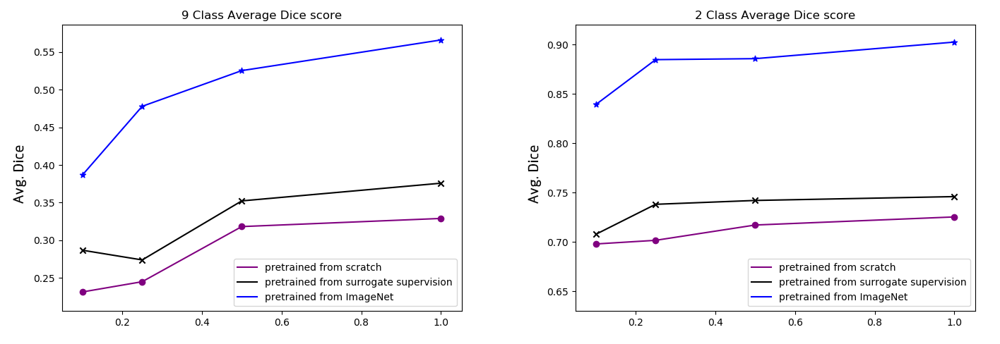

# Surrogate Supervision for Skin Segmentation

## Data

Body skin segmentation is a multi-class segmentation problem for tele-medicine images where each pixel is labeled as background, uncertain, face, hand, foot, limb, trunk, scalp, or anogenital.
The private dataset we used contains over 330,000 RGB tele-medicine images taken by cell phone cameras.
We have manually labeled the segmentation masks for 1,692 images.

### 1. Skin Segmentation:
Among the 1,692 labeled images, 1,435 images are used for training (*Trl*), 100 are used for validation (*Vl*), and 163 are used for testing (*Tel*).

For preprocessing, all images are cropped into 513 x 513 with their center randomly positioned inside the original feasible area.
A padding value of 255 for all RGB channels are filled to deal with undefined regions.
The pixel values are then normalized into the range of -1 to 1 for all RGB channels.

### 2. Skin Colorization:
The model was trained using the 1,435 segmentation training images (*Trl*), 100 segmentation validation images (*Vl*), and the remaining unlabeled ~330,000 images (*Du*). The model is tested on the 163 segmentation testing data (*Tel*).

The preprocessing follows the same method adopted by skin segmentation model.
All images are also converted into grayscale images.
Each grayscale image is repeated 3 times along the depth to make its dimension same as its original RGB image.

## Architectures

### 1. Surrogate Supervision Skin Colorization:

This condtional GAN model follows the same training and inference procedures as proposed in the original cGAN paper [2].

The input for the discriminator network is the concatenation of the real/fake RGB image and grayscale image.
Because the fake RGB image has a dimension of 129 x 129 x 3,
the corresponding real image and grayscale image are also downscaled to 129 x 129 x 3.
Therefore, the final input dimension for the discriminator is 129 x 129 x 6.

The generator network follows the DeepLabV3+ framework [1].
The backbone is the ResNet 50 beta network with all details listed clearly at [DeepLabV3+ Github Home Page](https://github.com/tensorflow/models/tree/master/research/deeplab).

### 2. Skin Segmentation:
The skin segmentation model is exactly the same to the generator network of the surrogate supervision colorization model except a different output dimension for the very last convolution layer shown in the figure above. The output dimension of this convolution layer needs to be changed to 9.

## Training Details
Both skin segmetation and colorization models were implemented using Tensorflow [3].
They were both trained on an NVIDIA 1080Ti GPU.

### 1. Skin Colorization:
Batch size is 4. Total number of training iterations is 76,000.
LS GAN loss [4] was selected. 
An Adam optimizer was used for configuring the learning rate with beta1 of 0.5 and beta2 of 0.999.
The learning rate started at 2e-4. 
The constant in the generator loss function is set to be 1, meaning that the ratio between the 
generator LS GAN loss and generator reconstruction loss is set to be 1.

### 2. Skin Segmentation:
Batch size is 4. Total number of training iterations is 300,000.
An Adam optimizer was used for configuring the learning rate with beta1 of 0.5 and beta2 of 0.999.
The learning rate started at 1e-4. Atrous rate is 6, 12, 18.
The output stride for the resnet50-DeepLabV3+ is 16 and decoder output stride is 4.

The model was trained from scratch, pretrained from the generator of the skin colorization model, and pretrained from ImageNet using 10%, 25%, 50%, and 100% of all the 1,435 training images (*Trl*). There has been altogether 3 x 4 = 12 skin segmentation models been trained.

## Results

The performances of skin segmentation model trained from scratch,
pretrained from the generator of the surrogate supervision cGAN model, and pretrained from ImageNet are shown above.
The left subplot is the performance on all 9 classes (i.e.: background, uncertain, face, hand, foot, limb, trunk, scalp, or anogenital).
The right subplot is the performance on only 2 classes (i.e.: background, or skin area).
These performances are measured in terms of average Dice score.
The x axis is the percentage of training data used for segmentation model.

## References

[1]: Liang-Chieh, et al. “Encoder-decoder with atrous separable convolution for semantic image segmentation,” in ECCV, 2018.

[2]: Phillip Isola, et al. “Image-to-image translation with conditional adversarial networks,” CoRR, vol. abs/1611.07004, 2016.

[3]: Abadi, Martín, et al. "Tensorflow: a system for large-scale machine learning." OSDI. Vol. 16. 2016.

[4]: Guo-Jun Qi, et al. “Loss-sensitive generative adversarial networks on lipschitz densities,” CoRR, vol.abs/1701.06264, 2017.
