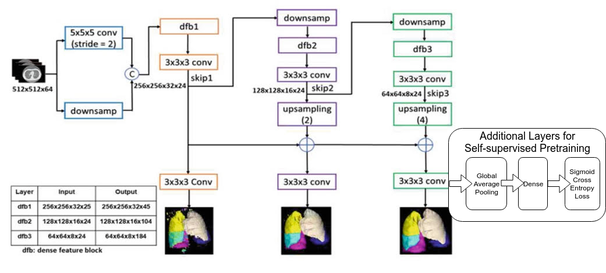
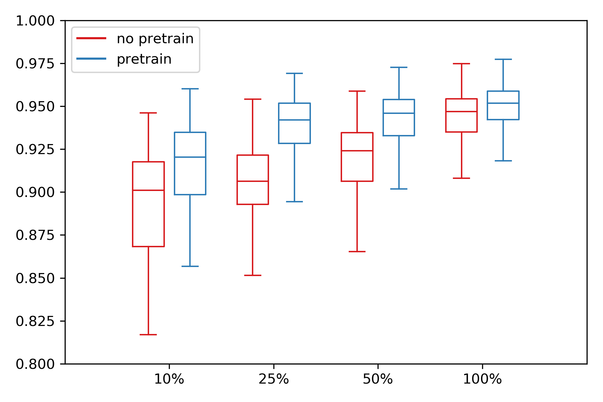

# Details of using self-supervision as initialization for lung lobe segmentation

## Data

Lung lobe segmentation consists of assigning every voxel in a chest CT to one of the 5 major lobes of the lung or back-ground. 
355 CT series from LIDC[1] dataset (1018 series total) was hand labeled using 3D-slicer [2]; the train-validation-test split is 250, 20, 85. Since the dataset
For self-supervised pretraining, we used the entire LIDC dataset excluding the testing set, consists of 933 CT series.

For preprocessing, the CT images are resampled to 1.8mm x 1mm x 1mm, and then center cropped to a common shape of 200x256x320, in z, y, and x axis.
The voxel values of the CT are clipped from -1100 to -400 in Hounsfield unit to enhance the appearance of the fissure lines, which are the critical indicators of the boundaries of different lung lobes.
Then the voxel values are further scaled to the range from -1 to 1.

## CNN architectral and training

Progressive Dense-Vnet (PDVnet)[3] was used for lung lobe segmentation; the architecture is shown in the figure below. 
For pretraining with self-supervision, the feature maps from the last convolution layer go through global-average-pooling and then a dense layer with 3 neuron output for for predicting flipping z, y, and x axis. 
Sigmoid cross entropy loss is used.
For lung lobe segmentation, the weights pretrained as described above are used to initialize the same network. The same Dice based loss function as described in [3] was used to train the lobe segmentation model.

The network was implemented using Tensorflow[4].
We used momentum optimizer with default configurations and learing rate of 0.01.
Both the surrogate supervision task and the target lung lobe segmentation model are trained on a nvidia 1080ti GPU with batch size of 1.

The box plot below shows the comparison of average lobe segmentation dice score on the test set between PDVnet trained with and without initilization with self-supervised pretraining. x-axis shows the percentage of the training data used and the y axis shows the average dice score for all 5 lobes.

[1]: Armato III, Samuel G., et al. "The lung image database consortium (LIDC) and image database resource initiative (IDRI): a completed reference database of lung nodules on CT scans." Medical physics 38.2 (2011): 915-931.

[2]: Fedorov, Andriy, et al. "3D Slicer as an image computing platform for the Quantitative Imaging Network." Magnetic resonance imaging 30.9 (2012): 1323-1341.

[3]: Hatamizadeh, Ali, et al. "Automatic Segmentation of Pulmonary Lobes Using a Progressive Dense V-Network." Deep Learning in Medical Image Analysis and Multimodal Learning for Clinical Decision Support. Springer, Cham, 2018. 282-290.

[4]: Abadi, Martín, et al. "Tensorflow: a system for large-scale machine learning." OSDI. Vol. 16. 2016.
